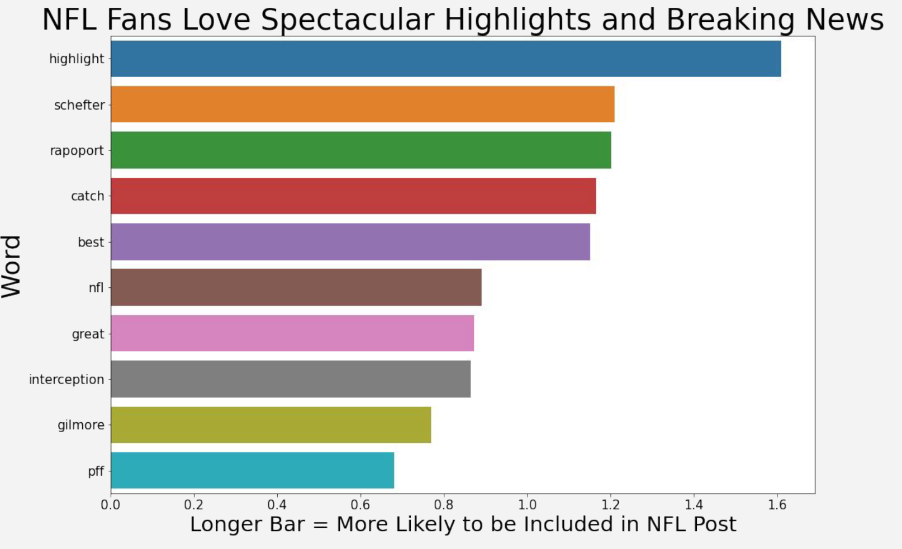
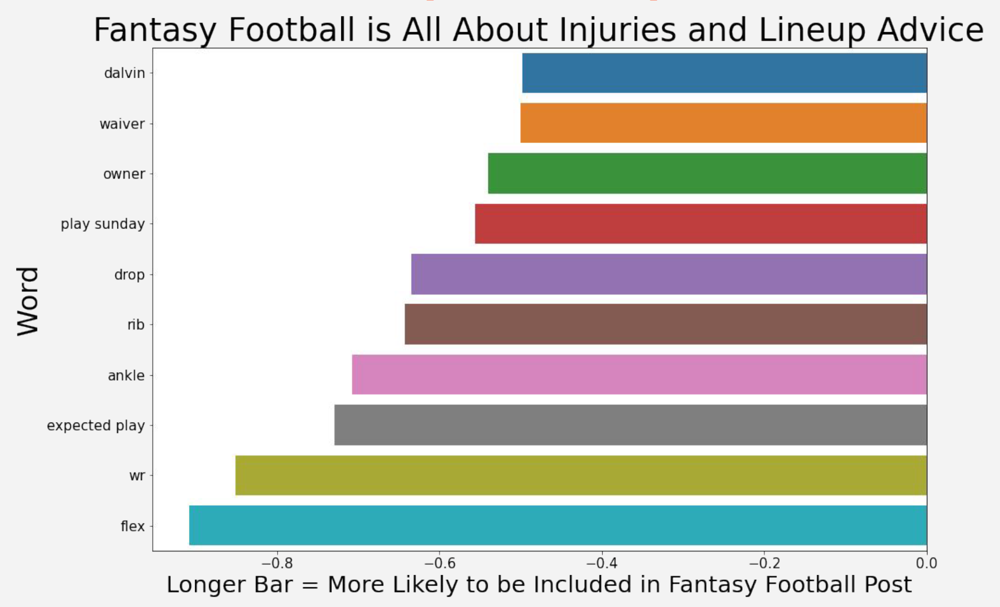

# Reading Reddit

## Problem Statement

Can we use a natural language processing model to determine (with at least 10% more certainty than a baseline model) whether fans speak differently about real football vs fantasy football on Reddit? If so, can we use this data to make more informed decisions about which new feature to prioritize adding to our fantasy football platform? This data is being presented to our app's product manager and their team.

## Executive Summary

This project involves analyzing data on Reddit posts from two different subreddits (r/fantasyfootball and r/NFL) and using natural language processing to determine which subreddit the title was posted in. The data was collected using Reddit's API. The API is restricted to a maximum of 100 posts per request, which is quite low given the high activity of these subreddits. In order to accomodate this restriction 10 pulls were made for each subreddit, each with a date range of a single day. This resulted in a total of 1,929 posts (993 from r/NFL and 936 from r/fantasyfootball). Some lower volume days did not hit the full 100 post limit, but this shouldn't impact the overall analysis. The data includes posts from 10/1/21 to 10/10/21. Data cleaning involved using a RegEx token to remove punctuation, lowercasing all words and performing lemmatization. A word count column was added as well, but was of minimaly useful in the final analysis and conclusions. 'Fantasy' and 'NFL' were also added as custom stop words as they were leading to very high accuracy scores and went against the spirit of this exercise. After some analysis 'Morning' was also added to the stop words as the r/fantasyfootball subreddit has eight daily threads with morning in the title which would have resulted in almost 10% of the r/fantasyfootball threads being easily predicted.

The first model used was logistic regression using count vectorization and a gridsearch over ngram ranges. An ngram range of 1,1 ended up performing the best, with an accuracy score of 79.3% on the test dataset. Coefficients were then pulled from the logistic regression model in order to interpret the results.

With coefficients mapped focus turned to finding the best performing model. Random forest, Naive Bayes and Gradient Boosting were tried with a gridsearch for multiple ngram parameters. The best performing model was Gradient Boosting with an ngram range of 1,3. This model performed with 81.16% accuracy in comparison to a baseline model of 51.48%. The prediction probabilities were also pulled out of the Gradient Boosting model and combined with the original data to get a better idea of which types of titles the model performed well and poorly on. 

## Data Dictionary

|  Feature |  Type |  Description |
|:-:|:-:|:-:|
|num_comments   |int64   |The number of comments on the post.   |
|score   |int64   |Score of the post calculated by the number of upvotes.   |
|subreddit   |object  |The name of the subreddit the post was submitted to.   |
|title   |object  |The title of the post.   |
|is_nfl   |int64   |Binary value for the post's subreddit. 0 indicates r/fantasyfootball and 1 indicates r/NFL   |
|date  |object   |The date of the post.   |
|clean_title  |object   |Title after cleaning. Lowercase, lemmatized, and punctuation removed.   |
|word_count  |int64   |The total word count of the post's title.   |

## Conclusion and Recommendations

We can indeed predict which subreddit a post belongs to with an accuracy that is ~50% than a baseline model. The coefficient and prediction probabilities data from this model indicates that fantasy football players are largely care about player injury news and advice on which players they should start each week. Conversely, posters on r/NFL mostly care to see spectacular highlights and breaking news from some of the NFLs most well known beat reporters. 

#### Recommendations - Feature Additions

- Prioritize features on our tech roadmap that involve getting real time status updates on player injuries and news. 
- Include suggestions on replacement players when a starter is ruled out with an injury.
- Give players dynamic advice on who to put in their starting lineup based on player projections.

